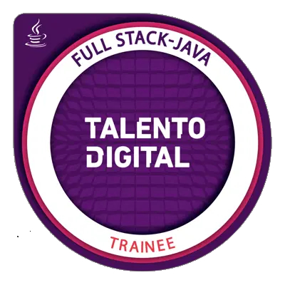

# 👋 Hola, soy Aldo!

### 🌐 Desarrollador Java Fullstack & Analista de Seguridad en Redes.

Desarrollador con experiencia en el ecosistema Java y egresado de Talento Digital. Ahora, apalancando mi experiencia de +10 años en atención al cliente y mi conocimiento en desarrollo, me estoy especializando en **Seguridad en Redes** para construir aplicaciones que no solo sean funcionales, sino también seguras y resilientes.

⚡ **Fun fact:** Soy más simpático después de haber dormido todas mis horas.

---

### 📂 Proyectos Destacados

| Proyecto | Descripción | Tecnologías Utilizadas |
|---|---|---|
| 🔗 **[Horóscopo Chino]** ([https://github.com/AldousTheWise/horoscopo-chino-jsp-jstl]) | Demo de página de Horoscopo, con control de usuarios y despliegue en HTML| `Java`, `JSP`, `PostgreSQL`, `JSTL` |
| 🔗 **[Análisis de Ataque SYN Flood]**([https://github.com/AldousTheWise/Analisis-Ataque-SYN-Flood])** | Informe práctico sobre la simulación, detección con Wireshark y mitigación con iptables de un ataque DoS. | `Hping3`, `Scapy`, `Wireshark`, `iptables` |

---

### 🛠️ Tecnologías y Herramientas

#### Desarrollo Fullstack

#### Ciberseguridad y Redes
_(Actualmente en formación y desarrollo)_

---

### 🏅 Certificaciones

- **Desarrollo FullStack Java** - Talento Digital para Chile 2025. 
- **Seguridad en Redes** - Desafío Latam (En curso).
- **Data Science** - Oracle ONE - Alura Latam (En curso)

---

### 📊 Mis Estadísticas

---

### 📫 ¡Hablemos!

> 🏹 "El código es el camino, y cada bug es solo una bestia más en la aventura."
